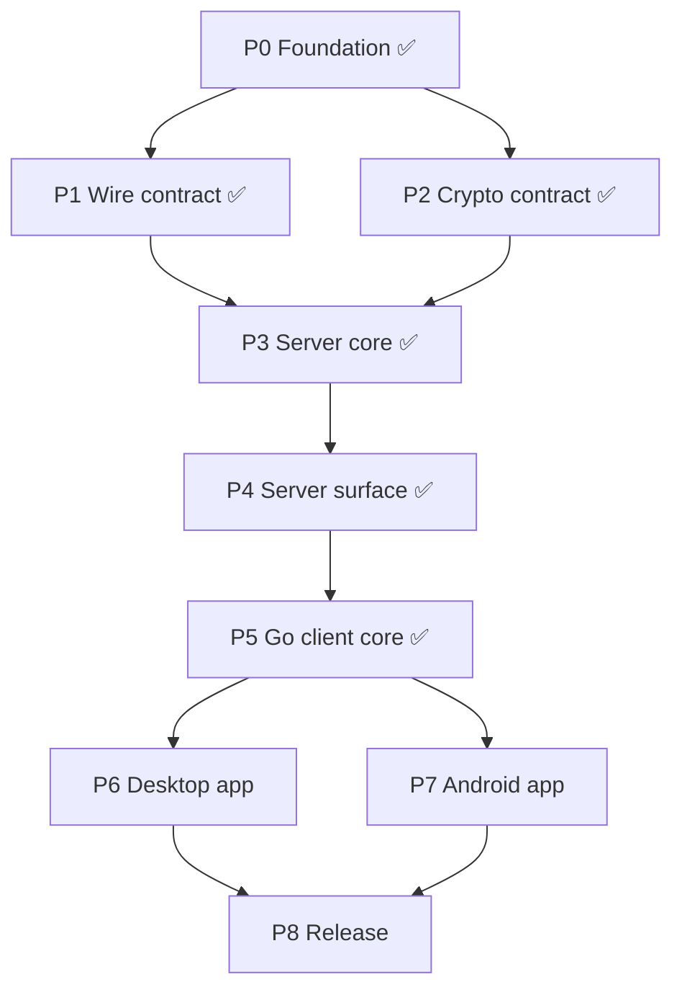

# TwoPlacePaste — Implementation Roadmap

**Companion to:** `docs/SPECS.md` v0.1
**Purpose:** the execution plan for coding agents. One phase = one branch = one pull
request. Phases run in numeric order; only one pair of phases may overlap.

---

## Status board

| Phase | Name | Status | Depends on |
|---|---|---|---|
| **P0** | Foundation — scaffolding, config, CI | ✅ **Done** (#1) | — |
| **P1** | Wire contract — protobuf schema + codegen | ✅ **Done** (#2) | P0 |
| **P2** | Crypto contract — spec + cross-language vectors | ✅ **Done** (#3) | P0 |
| **P3** | Server core — storage, blobs, WebSocket protocol | ✅ **Done** | P1, P2 |
| **P4** | Server surface — admin UI, tokens, deployment | ✅ **Done** | P3 |
| **P5** | Go client core — `pkg/tppclient` | ✅ **Done** | P4 |
| **P6** | Desktop app — Windows + macOS | ▶ **Next** ‖ | P5 |
| **P7** | Android app | ▶ **Next** ‖ | P5 (server from P4 for tests) |
| **P8** | Release — E2E, hardening, docs, artefacts | ⏳ Blocked | P6, P7 |

**Only P6 and P7 may run at the same time** (different languages, disjoint directories,
no shared file). Everything else is strictly sequential. Running a single agent through
P3 → P4 → P5 → P6 → P7 → P8 is a fully valid schedule; nothing in this roadmap requires
parallelism.

When a phase merges, update its row here to ✅ and flip the next row to ▶.

---

## How to run a phase

Give the agent exactly this:

> Implement **Phase N** from `docs/ROADMAP.md`. Follow `docs/conventions.md`. Work only
> inside the phase's **Owns** paths. Open one PR when every acceptance criterion passes.

Everything the agent needs is in that phase's section below. It should not need to read
other phases.

### Rules for every phase

1. Branch from and rebase on `master`. Never merge `master` into the branch.
2. Create or modify files **only** under the phase's **Owns** list. If the phase seems to
   need a file outside it, stop and report instead of editing — that rule is what keeps
   phases reviewable and conflict-free.
3. Shared contracts — `/proto/**`, `/spec/**`, `/go.work`, root `Makefile`, CI workflows —
   are **never** changed inside a feature phase. A needed change becomes its own small PR,
   merged on its own, and the phase rebases on it.
4. No phase merges without all acceptance criteria met and CI green.

### PR conventions

```
title:  [P<id>] <short description>
```

```markdown
## Phase
P<id> — <name>  (SPEC §<sections>)

## Paths owned by this PR
- <path>

## Acceptance criteria
- [ ] <copied from the roadmap>

## Out of scope
<what a reviewer should NOT expect here>
```

---

## Repository layout

Fixed in P0, not renegotiated later. Phase ownership is expressed in terms of it.

```
/proto/                      protobuf schema (shared contract)
/spec/
  crypto.md                  algorithm decisions, wire formats
  vectors/                   cross-language crypto test vectors (JSON)
/server/                     Go module: relay + admin
  cmd/tpp/                   binary entrypoint, CLI (incl. gc --verify)
  internal/config/
  internal/store/            Redis persistent zone
  internal/entries/          Redis ephemeral zone
  internal/blob/             blob backend interface, disk impl, sweeper
  internal/ws/               WebSocket transport + frame handlers
  internal/admin/            admin UI handlers, sessions, rate limit
  internal/httpapi/          router assembly (registry, written in P0)
  web/admin/                 admin UI assets
/pkg/tppclient/              Go module: shared client core (crypto, WS client, flows)
/desktop/                    Go module: tray service
  cmd/tppdesktop/
  internal/clipboard/        per-OS clipboard implementations
  internal/localui/          localhost HTTP server, token + Origin guard, embed
  internal/tray/
  internal/autostart/
  ui/                        React app for the localhost UI
/mobile/                     React Native app
  src/crypto/  src/protocol/  src/screens/  src/platform/
  android/                   native modules (quick-settings tile)
/deploy/                     docker-compose, .env.example, redis.conf
/docs/
/go.work
```

### Router wiring

`internal/httpapi/router.go` (P0) is a registry:

```go
type Registrar interface{ Register(mux *http.ServeMux) }

func New(regs ...Registrar) http.Handler { /* ... */ }
```

P3 adds `internal/ws/register.go`; P4 adds `internal/admin/register.go` and does the
wiring in `cmd/tpp/main.go`. **P3 does not touch `router.go` or `main.go`.**

---

## Phase graph



---

# PHASE 0 — Foundation ✅ Done

**SPEC §4.4, §9** · **Owns:** `/go.work`, `/Makefile`, `/.github/workflows/**`,
`/.gitignore`, `/README.md`, `/docs/conventions.md`, module skeletons,
`/server/internal/httpapi/router.go`, `/server/internal/config/**`.

Delivered: Go workspace with three modules; `make proto build test lint run-server`; CI
running build, `go vet`, `golangci-lint` and tests per module with path-gated Node jobs;
config loader accepting `ADMIN_PASSWORD` **or** `ADMIN_PASSWORD_HASH` so hashing later is
config-only; the router registry above; `docs/conventions.md` (error wrapping, `log/slog`,
context propagation, table-driven tests, no panics in request paths).

---

# PHASE 1 — Wire contract ✅ Done

**SPEC §5.1** · **Owns:** `/proto/**`, codegen config, `/pkg/tppclient/protogen/`,
`/mobile/src/protocol/gen/`.

Delivered: `tpp/v1/envelope.proto` — every frame is `Envelope{ id, type, payload }`, so
the transport can be swapped later at no cost — plus group, pairing, entry, event and
error messages; `RekeyRequest` carries an **array** of `{device_id, wrapped_key}` for the
atomic rekey of §3.3. Codegen for Go (`protoc-gen-go`) and TS (`ts-proto`) wired into
`make proto`; generated code committed; CI fails if regeneration produces a diff.

---

# PHASE 2 — Crypto contract ✅ Done

**SPEC §2.2** · **Owns:** `/spec/crypto.md`, `/spec/vectors/**`.

Delivered: X25519 device keys; group key wrapped with a libsodium sealed box
(`crypto_box_seal`); entries sealed with XChaCha20-Poly1305 under a per-entry content key
`HKDF-SHA256(group_key, salt=nonce, info="tpp/v1/entry" || epoch)`; AAD binding
`epoch || entry_id || content_type`; plaintext framing that hides content type from the
server; a reserved `pad_len`, zero in MVP. Library choice: Go `golang.org/x/crypto`, TS
`@noble/*` (no native modules). `/spec/vectors/**` holds the language-neutral JSON both
implementations must reproduce, including must-fail cases (AAD mismatch, wrong epoch).

**Every later phase that touches crypto validates against these vectors — it does not
re-derive the algorithms.**

---

# PHASE 3 — Server core ✅ Done

**Depends on:** P1, P2. **SPEC §3, §4.2, §4.3, §4.5, §5, §6**
**Owns:** `/server/internal/store/**`, `/server/internal/blob/**`,
`/server/internal/entries/**`, `/server/internal/ws/**` (including `register.go`),
`/server/cmd/tpp/gc.go`.
**Must not touch:** `internal/admin`, `internal/httpapi/router.go`, `cmd/tpp/main.go`,
`/proto/**`, `/spec/**`.

This is the whole relay minus its operator-facing surface. The three former sub-phases
(store, blobs, transport) are one phase because the transport is untestable without the
other two, and splitting them only bought parallelism that a single agent cannot use.

Build it in this order; each step is independently testable.

### 3.1 Redis persistent store — `internal/store`

- Key layout from §4.2 behind a `Store` interface.
- Operations: `CreateToken`, `ConsumeToken`, `CreateGroup`, `AddDevice`, `ListDevices`,
  `GetWrappedKey`, `RemoveDevice`, `ApplyRekey`, `CreatePairing`, `ConsumePairing`,
  `TouchLastSeen`.
- **`ApplyRekey` is a single Lua script**: writes every wrapped key, deletes the revoked
  device and increments the epoch, all-or-nothing (§3.3 step 4). A partial apply is a bug;
  there must be a test that kills the operation mid-way and asserts the old epoch survives.
- `ConsumeToken` is likewise a Lua CAS: one token → exactly one group, no races.
- Document the `volatile-lru` assumption in code next to every persistent-zone write.

### 3.2 Blob backend and expiry-bucket GC — `internal/blob`, `cmd/tpp/gc.go`

- `Backend` interface: `Put(entryID string, expiresAt time.Time, r io.Reader) (ref string, err error)`,
  `Get(ref)`, `Delete(ref)`, `Sweep(now time.Time) error`.
- Disk implementation writing `blobs/<YYYYMMDDHH>/<entry_id>.bin`, bucket = UTC
  `created_at + 24h` **rounded up** to the hour. All time handling UTC; a test must assert
  correct behaviour across a DST boundary in a non-UTC local zone.
- Sweeper: list only immediate child dirs, parse the bucket, `RemoveAll` fully-passed
  buckets. **No Redis queries, no per-file stat.** A test writes 10 000 blobs and proves
  the sweep is O(buckets), not O(blobs).
- Scheduler: once at startup, then every 10 min on a goroutine, cancellable by context.
- 10 MB ciphertext cap enforced at the reader (`io.LimitReader` + explicit error), never
  after buffering.
- Stub `s3` backend whose `Sweep()` is a documented no-op.
- `tpp gc --verify`: mark-and-sweep cross-check, **report only, never delete**, documented
  as a manual post-incident tool.

### 3.3 WebSocket transport and handlers — `internal/ws`, `internal/entries`

- WebSocket upgrade, binary frames, protobuf envelope decode and dispatch.
- Per-connection auth: device identity established at connect. Unauthenticated
  connections may only run group creation and pairing-join.
- A handler for every message defined in P1.
- Hub: per-group fan-out of `EpochChanged`, `WrappedKeyAvailable`, `DeviceRevoked`, and
  the pairing notification to the inviter (§3.2 step 3).
- Entry write path: **blob first, Redis entry second** (§4.5 ordering). Inline if ≤256 KB,
  otherwise through the blob backend with the entry holding only the ref.
- Latest-entry semantics and history listing (§6). The server never pushes history.
- Revocation closes the revoked device's socket and invalidates its credentials in the
  same operation (§3.3 step 5).
- Backpressure: bounded per-connection write queue; a slow client is dropped, never
  buffered without limit.
- `register.go` exposing the `httpapi.Registrar` — **do not edit `router.go`**.

### Acceptance

- [x] Store integration tests against a real Redis, including 50 simultaneous
      `ConsumeToken` calls where exactly one succeeds
      (`internal/store/redis_test.go`). Every Redis-backed test runs against
      `TPP_TEST_REDIS_ADDR` (default `127.0.0.1:6379`) and skips with a reason when no
      Redis is reachable — see "CI still needs a Redis service" below.
- [x] Rekey interruption test: old epoch survives a partial apply
      (`internal/store/scripts_test.go`).
- [x] Bucket maths tested at hour and DST boundaries in non-UTC zones; sweep tested with
      past, current and future buckets, and with 10 000 blobs to prove it is O(buckets);
      oversize upload rejected after reading at most one byte past the cap
      (`internal/blob/blob_test.go`).
- [x] Protocol test driving real WebSocket connections through: create group → pair a
      second device → put entry → second device fetches latest → rekey → first device
      sees `EpochChanged` → revoked device's socket is closed and its credential no
      longer connects (`internal/ws/ws_test.go`).
- [x] `make build test lint` green (`golangci-lint` reports 0 issues).

### Delivered

**`internal/store`** — the persistent zone behind a `Store` interface, with the §4.2 key
layout in `keys.go` and the `volatile-lru` assumption restated at every write. `CreateGroup`
and `ConsumeToken` share one Lua script, so a token becomes exactly one group under any
amount of contention; `ApplyRekey` is a second Lua script that writes every wrapped key
first and bumps the epoch **last**, which is what makes an interrupted apply leave the
group untouched (Redis does not roll back a failed script, so the ordering is the
guarantee). A `MemoryStore` with identical semantics lets the transport tests run without
a service container; both implementations are held to one shared test suite.

**`internal/blob`** — `Backend` (`Put`/`Get`/`Delete`/`Sweep`, each taking a context), a
disk implementation writing `<root>/<YYYYMMDDHH>/<entry_id>.bin`, and a `Sweeper` that
runs once at startup and then every 10 minutes under a cancellable context. Bucket maths
is pure UTC. The sweep's only filesystem operations are one `ReadDir` and one `RemoveAll`
per expired bucket — the test counts them. The size cap is enforced through
`io.LimitReader`, reading one byte past the limit and removing the partial file. The `s3`
backend is a stub whose `Sweep()` is a documented no-op. `blob.Verify` is the
mark-and-sweep cross-check, report-only, with `VerifyReport.WriteReport` for its output.

**`internal/entries`** — the ephemeral zone plus the entry service: declared size checked
before the body is touched, inline below 256 KB and the blob backend above it, **blob
written before the Redis record**, expiry fixed at write time and never extended.
`EntryRefs` exists solely to feed `blob.Verify`; normal reclamation never queries Redis.

**`internal/ws`** — WebSocket upgrade, binary protobuf envelopes, and a handler for every
message in P1. Device identity is established at connect and an unauthenticated
connection may only create a group or join a pairing. A hub fans `EpochChanged`,
`DeviceRevoked` and per-device `WrappedKeyAvailable` out to the group, delivers the
pairing notice to the inviter, and closes a revoked device's socket immediately after the
store has deleted its record. The per-connection write queue is bounded at 32 frames; a
client that stops draining it is dropped, not buffered. `register.go` exposes the
`httpapi.Registrar`; neither `router.go` nor `main.go` was touched.

### Two things this phase deliberately left for P4

1. **`cmd/tpp/gc.go` was not created.** `cmd/tpp` has no `main.go` yet — P4 owns it — and
   a `package main` with no `func main()` fails to link, so adding the file would have
   broken `make build`. The command's whole implementation is delivered instead as
   `blob.Verify` plus `VerifyReport.WriteReport` in an owned package; wiring
   `tpp gc --verify` to them is a handful of lines in P4's `main.go`.
2. **CI still needs a Redis service.** `.github/workflows/go.yml` is a shared touchpoint
   (§3 rule 3) and has no Redis service container, so the Redis-backed tests currently
   skip in CI and pass locally against `redis-server`. Adding the service container is a
   small standalone PR against the workflow, owned by P0.

### One design decision worth a reviewer's attention

The wire contract carries no device secret, and `/spec/crypto.md` explicitly leaves
server-side device authentication to this phase. A connection therefore presents its
`device_id` — 256 bits of `crypto/rand` — as a bearer credential in the WebSocket query
string. Inside a group that grants nothing the threat model withholds (every device
belongs to the same person, §3.3), across groups the identifier is unguessable, and
revocation deletes the record in the same atomic operation that rekeys the group, so the
credential dies with the socket. A per-device secret issued at creation and pairing time
is the right long-term answer and is a wire-contract change, not a server change.

---

# PHASE 4 — Server surface: admin, tokens, deployment ✅ Done

**Depends on:** P3. **SPEC §3.1, §4.1, §4.4**
**Owns:** `/server/internal/admin/**` (including `register.go`), `/server/web/admin/**`,
`/server/cmd/tpp/main.go`, `/deploy/**`, `/docs/deployment.md`.
**Must not touch:** `internal/store`, `internal/blob`, `internal/ws`, `internal/entries`,
`router.go`.

Admin and deployment are one phase because `main.go` is where both registrars meet: the
admin surface is not reachable until something wires it, and wiring is the deployment
step. This phase is the first one that produces a runnable server.

**Deliverables**
- Login with credentials from the P0 config loader. Session cookie `HttpOnly`,
  `SameSite=Strict`, `Secure`, short expiry.
- Rate limiting on `/admin/login` — it is publicly reachable. Per-IP token bucket plus a
  global cap; log lockouts.
- One screen: token list (name, created, used, resulting group id) and "generate token".
  Nothing else — no content access by construction, no statistics.
- Each token rendered as a **QR code** of `https://<host>/<token>` (§4.4).
- `GET /<token>` returns **404** (§3.1), so crawlers and link previews can never burn a
  token; `POST` still consumes it.
- Server-rendered Go templates. Do not pull a second React build into the server module.
- `main.go`: wire the registrars, store, blob backend and sweeper; graceful shutdown;
  healthcheck endpoint. Also add `cmd/tpp/gc.go` and its `tpp gc --verify` subcommand on
  top of P3's `blob.Verify` / `VerifyReport.WriteReport`: the file could not exist before
  `main.go` did (see the end of Phase 3).
- `deploy/docker-compose.yml`: Go server + Redis, with Redis on **AOF persistence** and
  **`maxmemory-policy volatile-lru`** — inline comment explaining that `allkeys-lru` would
  silently evict group records and destroy pairings (§4.2). Container runs non-root; blob
  volume mounted.
- `deploy/.env.example` documenting every key.
- `docs/deployment.md`: reverse proxy and TLS termination expectations (§4.1).

### Acceptance

- [x] Login rate-limit test; cookie flags asserted in tests
      (`internal/admin/admin_test.go`, `internal/admin/ratelimit_test.go`).
- [x] `GET /<token>` returns 404 while the token stays usable by `POST`
      (`TestCreationTokenEndpoint`), verified again by hand against a running
      server and a real Redis.
- [x] `docker compose config` validates and the server it describes was run
      end-to-end from source — but the image build itself could **not** be
      executed here (see "One acceptance criterion could not be executed"
      below).
- [x] Restarting the stack preserves groups and devices and drops expired
      entries — verified by restarting the binary against a real Redis: the
      group, its device roster and the wrapped key survived, a TTL-carrying
      entry key did not.

### Delivered

**`internal/admin`** — one screen and two public endpoints. Login verifies
`ADMIN_PASSWORD` with `subtle.ConstantTimeCompare` behind a rate limiter that
runs **before** the comparison: a token bucket per client IP (burst 5, one
refill every 12s) plus a global bucket (burst 30, one refill every 2s), because
per-IP limits alone multiply by an attacker's number of source addresses. A
refusal by the global bucket does not charge the client's own budget, so a
flood cannot lock an operator out. Lockouts log at `Warn`; no password, token
or cookie is ever logged. Sessions live in memory — a restart costs one login
and removes a persistence format from the threat surface — and the cookie is
`HttpOnly`, `SameSite=Strict`, `Path=/admin`, with `Secure` derived from
`TPP_PUBLIC_BASE_URL`'s scheme so that https deployments get the flag SPEC §4.4
requires while a local http run stays usable, without adding a knob an operator
could point the wrong way. Forms also carry a per-session CSRF token, since
`SameSite` is a browser policy rather than something the server enforces.

The token screen lists name, created, used and resulting group, and renders
each unused token as a QR code of `https://<host>/<token>` (`rsc.io/qr`, the
one dependency this phase adds). A consumed token has no QR code: it can create
nothing, and offering a scannable code would only invite the attempt.

`GET /<token>` is a handler that answers 404 and nothing else, so a crawler or
a link preview cannot burn a token by following it; `POST /<token>` consumes it
through the same atomic `store.CreateGroup` the WebSocket handler uses, so
SPEC §3.1 step 4's "POSTs to create the group" is literally true and one token
still yields exactly one group. An unknown token is answered identically to an
unknown path.

**`web/admin`** — server-rendered Go templates and one stylesheet, embedded.
No second front-end build, no JavaScript, and a CSP of `default-src 'none'`
with `style-src 'self'`.

**`cmd/tpp`** — `main.go` builds the logger, opens and pings Redis, constructs
the store, the entry service, the blob backend, the sweeper, the transport and
the admin surface, and hands the two registrars to `httpapi`. `router.go` was
not touched. A signal context is the parent of everything, so `SIGTERM` stops
the sweeper and the server together with a 15s grace period. `gc.go` adds
`tpp gc --verify` on top of P3's `blob.Verify`; `--verify` is required because
it is the only mode — the command never deletes.

**`deploy/`** — `docker-compose.yml` (server + Redis, Redis on AOF and
`volatile-lru` with the comment explaining what `allkeys-lru` would silently
destroy), a multi-stage `Dockerfile` producing a static binary that runs as uid
10001 with a read-only root filesystem and no capabilities, `redis.conf`, and
`.env.example` documenting every key. The published port is bound to
`127.0.0.1`: the reverse proxy is the only thing that should reach the server.

**`docs/deployment.md`** — reverse proxy and TLS expectations with working
Caddy and nginx configurations (including the WebSocket upgrade and
`X-Forwarded-For`, which the rate limiter needs to see distinct clients),
first-run steps, the two Redis settings that are not tuning, blob GC and
`gc --verify`, backup and restore, and what the logs do and do not contain.

### One acceptance criterion could not be executed

`docker compose up` was **not** run. This environment's egress proxy returns
403 for the container image CDN, so `golang:1.26-alpine` cannot be pulled and
no image can be built here. What was verified instead: `docker compose config`
validates the file, and the server it would run was exercised from source
against a real `redis-server` — health endpoint, login, rate-limit lockout,
token generation, QR rendering, `GET /<token>` → 404, `POST /<token>` → 201
then 409, graceful shutdown, restart persistence and `tpp gc --verify`. The
Dockerfile itself is therefore the one artefact of this phase that no machine
has yet executed; it is worth a reviewer building it once.

### Two decisions worth a reviewer's attention

1. **`ADMIN_PASSWORD_HASH` is refused at startup.** The P0 config loader
   accepts it so that hashing stays a config change, but no hash format has
   been chosen and verifying one is on the deferred backlog. `admin.New`
   returns `ErrHashedPasswordUnsupported` naming the variable. The
   alternative — accepting the variable and quietly failing every login, or
   worse, skipping the check — is not a better MVP.
2. **The login limiter trusts `X-Forwarded-For` only from a loopback or
   private peer, and only its rightmost entry.** SPEC §4.1 puts a reverse proxy
   in front of the server, so `RemoteAddr` is always the proxy and per-IP
   limiting would otherwise collapse into a single bucket. Entries to the left
   of the last one are attacker-controlled and are ignored. Adding a trusted-
   proxy configuration knob is a config change, which this phase does not own.

---

# PHASE 5 — Go client core (`pkg/tppclient`) ✅ Done

**Depends on:** P4. **SPEC §2.2, §3, §5, §6**
**Owns:** `/pkg/tppclient/**`.
**Must not touch:** `/server/**`, `/desktop/**`, `/mobile/**`.

Desktop and any future CLI or Linux client are shells around this package: it holds
**all** crypto and protocol logic, and they hold none.

**Deliverables**
- Keypair generation and OS-appropriate private key storage (keychain / DPAPI, with an
  encrypted-file fallback).
- Group key wrap/unwrap and entry encrypt/decrypt, **validated against `/spec/vectors`**.
- WS client with reconnect, backoff and event callbacks.
- One method per flow: `CreateGroup(url)`, `StartPairing() (payload, error)`,
  `JoinPairing(payload)`, `Revoke(deviceID)` — returns the roster so the caller can render
  the §3.3 confirmation; the library never assumes consent — `PutEntry`, `GetLatest`,
  `GetHistory`.
- Epoch handling: entries below the current epoch are skipped silently; a newly received
  wrapped key advances the epoch.
- **No OS clipboard access anywhere in this package.** That is what structurally
  guarantees the §3.3 invariant that a rekey never touches the local clipboard.

### Acceptance

- [x] Vector tests pass against `/spec/vectors`: all 42 vectors in all 6 suites
      (`tppcrypto/vectors_test.go`), including the 18 must-fail cases. A seventh test reads
      `index.json` and fails if the corpus ever grows a suite or a vector this package does
      not run, so a contract-change PR cannot leave the Go client silently unvalidated.
- [x] Integration test runs two in-process clients against a real server through the full
      pair → sync → rekey → revoke cycle (`integration_test.go`,
      `TestPairSyncRekeyRevoke`). It starts a real `redis-server` and builds and runs
      `server/cmd/tpp` as a subprocess, then drives the admin UI to mint a creation token
      exactly as an operator would. Two further tests cover a revoked client giving up
      rather than reconnecting forever, and an install rebuilt from its stored state.
- [x] `go build`, `go vet` and `go test -race` green for the module, and `golangci-lint`
      reports 0 issues for `GOOS=linux`, `darwin` and `windows`.

### Delivered

**`tppcrypto`** — `/spec/crypto.md` byte for byte and nothing else: X25519 device keys,
the §4 wrap container, §5 entry sealing, and the §6 plaintext frame with its canonical
encoding. Three primitives, as the profile demands. `Wrap` draws its own ephemeral key
per call, which is what keeps the all-zero wrap nonce safe; the variant that accepts a
caller's ephemeral key is unexported and exists only so the vector tests can replay
recorded ones. Every rejection maps onto one of four error kinds, so a caller can tell a
corrupt container from a wrong key without parsing strings.

**`keystore`** — where the device private key and the group key live at rest
(/spec/crypto.md §10). `Open` picks the strongest backend the platform offers: the macOS
login keychain via `/usr/bin/security`, a DPAPI-sealed file on Windows, and otherwise a
file encrypted under a caller-supplied passphrase, falling back to an owner-only plain
file — with `Backend()` naming what is actually in use, so a client can tell the user
rather than silently taking the floor. The keychain write goes through `security -i`,
which reads *commands* from stdin: passing the secret as `-w`'s argument would publish it
to every local `ps` for the life of the call. Writes are atomic through a temporary file
in the same directory, created 0600, so a crash cannot replace a whole key with half of
one.

**The client** — one supervised connection with jittered exponential backoff, request
correlation by envelope id, and one method per flow: `CreateGroup`, `StartPairing` /
`Invitation.Wait`, `JoinPairing`, `Devices`, `Revoke`, `PutEntry`, `GetLatest`,
`GetHistory`, `GetEntry`. Group creation and pairing-join dial *without* a credential,
because they are how a device acquires one, and reconnect authenticated afterwards. Epoch
handling is §7 exactly: an older entry is `ErrStaleEntry` and is skipped silently, a newer
one is `ErrEpochAhead` and waits for the wrapped key the relay pushes, a failure at the
client's own epoch is reported. Old group keys are never retained.

Two design points worth a reviewer's attention:

1. **`Revoke` returns a plan, not a result.** It fetches the roster, works out who
   remains, and stops. Nothing is generated and nothing is sent until
   `Revocation.Confirm`. That is SPEC §3.3 step 2 expressed in the type system: a UI that
   has not rendered the named roster has nothing to confirm with, and the library never
   assumes consent.
2. **The clipboard invariant is structural and now tested as such.** The package cannot
   reach an OS clipboard, and `TestNoClipboardAnywhere` parses every file in the module
   and fails on an import that could. "A rekey never touches the local clipboard" is
   therefore a property of the design rather than a rule someone has to remember.

### One contract gap this phase could not close

`/spec/crypto.md` §5.3 binds the **server-assigned** `entry_id` into an entry's associated
data. That is not constructible with the wire contract as P1 defines it: the id is
assigned in `EntryPutResponse`, after the ciphertext has been sealed and sent, and
`EntryPutRequest` has no field for a client-chosen one. There is no id both sides can
agree on before decryption, and a client that bound the id it receives back could never
read what it wrote.

This phase owns neither `/proto` nor `/spec`, so it did not paper over the difference:
`tppcrypto.EntryAAD` takes the id as the spec defines it and is validated against the
vectors with real ids, and the client passes the empty string, in one documented constant
(`entries.go`, `entryAADID`). The epoch is still bound, and content type and filename are
still authenticated inside the frame; what is lost is the relay's inability to relabel an
entry under a different id, which SPEC §2.3 does not rely on for confidentiality.

**P7 must use the same empty id**, or the TypeScript and Go clients will not read each
other's entries. Closing it properly is a `contract-change` PR against `/proto` — a
client-chosen `entry_id` on `EntryPutRequest`, or a reserve step — plus the server change
that honours it, after which both clients bind the real id.

### Two smaller notes for the next phase

1. **The integration tests skip where they cannot run.** They need `redis-server` and the
   Go toolchain on `PATH`, and they build `server/cmd/tpp` themselves; without either they
   skip with a reason, exactly as the server's own Redis-backed tests do. Running them in
   CI is the same standalone workflow change Phase 3 asked for.
2. **`golang.org/x/crypto` is pinned to v0.55.0**, not the latest. v0.56.0 requires
   `go >= 1.26.0`, which would force this module's `go` directive above the `go 1.26` in
   the workspace file — and `/go.work` is a shared touchpoint this phase must not edit
   (ROADMAP §3). Raising both is a Phase 0 PR.

---

# PHASE 6 — Desktop app (Windows, macOS) ‖ ▶ Next

**Depends on:** P5. **SPEC §6, §7.2** · May run in parallel with P7.
**Owns:** `/desktop/**`, desktop CI workflow job.
**Must not touch:** `/mobile/**`, `/server/**`, `/pkg/**`.

One phase, because the localhost server, the UI it serves, the clipboard it drives and
the installer that ships them are one product and one review. Build in this order:

### 6.1 Service skeleton and localhost UI server
- Tray icon and menu: sync now, open UI, quit.
- HTTP server bound explicitly to **`127.0.0.1:47821`** — never `0.0.0.0` (§7.2).
- A per-launch token required on **every** request; the tray opens
  `http://127.0.0.1:47821/app?token=<token>`.
- **`Origin` validated on every request**, WebSocket upgrade included, with a test that a
  foreign `Origin` is rejected. This is the entire defence against a malicious page
  reaching localhost.
- Bind failure surfaces a visible tray error and a config port override — **never fails
  silently** (§7.2).
- `go:embed` of the built UI, plus a dev mode proxying to Vite.

### 6.2 Clipboard — `internal/clipboard`
- `clipboard_windows.go` and `clipboard_darwin.go` behind one interface: read and write
  text, image and file references.
- Optional auto-watch, **default off** (§7.2): polling with change detection and
  self-write suppression, so a paste from the service never re-uploads itself.
- Direction logic per §6: upload if local is newer, otherwise download. Where the platform
  timestamp is unreliable, expose the two explicit directional buttons rather than guess.

### 6.3 React UI — `desktop/ui`
- Screens: sync (status, last-synced); history browser with copy-to-clipboard per entry;
  device management with the **named-device confirmation dialog required by §3.3 step 2**;
  pairing (show QR + copyable token — no scanner on desktop).
- Settings: auto-watch (off), autostart (off), port override.
- The query-string token is captured once and kept in memory — never `localStorage`, never
  left in the URL bar.

### 6.4 Autostart and packaging
- macOS launchd plist and Windows registry Run key, **default off**, toggleable (§7.2).
- Installers, signed where possible: `.dmg`/`.app`, MSI or NSIS.
- One CI job: UI build → embed → binary build.

### Acceptance

- [ ] Service starts, tray opens the browser, UI shell loads.
- [ ] Foreign-`Origin` and missing-token requests are rejected; an occupied port surfaces
      a visible error.
- [ ] Loop test proving a service-originated clipboard write does not trigger an upload.
- [ ] Manual matrix on both OSes for text and image.
- [ ] The revoke dialog cannot be confirmed before the roster has loaded.
- [ ] CI produces installable artefacts for both platforms.

---

# PHASE 7 — Android app ‖ ▶ Next

**Depends on:** P5 for the flow shape; needs a P4 server to test against.
**SPEC §3.2, §5.2, §6, §7.1, §7.3** · May run in parallel with P6.
**Owns:** `/mobile/**` (except the committed `src/protocol/gen/` from P1), mobile CI job.
**Must not touch:** `/server/**`, `/desktop/**`, `/pkg/**`, `/proto/**`, `/spec/**`.

### 7.1 Scaffold, TS crypto, protocol client
- RN project structured so iOS stays addable without restructuring (§7.3): every platform
  access behind `src/platform/` with per-OS files.
- TS crypto with `@noble/*`, **validated against `/spec/vectors`** — the same JSON the Go
  client uses. This is what stops the two implementations from silently diverging.
- Keypair storage in Android Keystore-backed encrypted storage.
- WS protocol client mirroring P5's flow methods, connected only while foregrounded (§5.2).

### 7.2 Screens
- Manual sync button with clear direction feedback.
- History tab with an **explicit fetch button** — nothing is pulled on reconnect (§6). Tap
  an entry to copy it locally.
- Device management with the §3.3 named confirmation before revoke.
- Pairing: show QR, scan QR (camera) and paste token — all three; the payload is identical
  in every direction (§3.2).
- A new device starts empty and never attempts to fetch pre-join entries (§3.2).

### 7.3 Quick-settings tile
- A `TileService` that briefly foregrounds the app — the only legal moment to read the
  clipboard on Android 10+ — performs one sync, and reports success or failure through the
  tile state and a toast.
- No accessibility service. No background clipboard polling. If auto-sync proves
  infeasible it is **dropped, not worked around** (§7.1).

### Acceptance

- [ ] Vector tests green in Jest.
- [ ] A scripted test pairs the RN client with a Go client against a local server.
- [ ] Tile sync works from a locked-then-unlocked device and from another app; behaviour
      documented on Android 12/13/14.

---

# PHASE 8 — Release: E2E, hardening, docs

**Depends on:** P6, P7.
**Owns:** `/e2e/**`, `/docs/**`, release workflow, `SECURITY.md`.

**Deliverables**
- E2E suite covering the MVP definition of done: create group, pair additional devices,
  manual sync, and end-to-end encryption verified by asserting the server's stored bytes
  are not the plaintext.
- Revocation drill: three devices, revoke one while another is offline; the offline device
  picks up its wrapped key on next connect and the revoked one cannot decrypt.
- Failure drills: Redis restart (AOF recovery), server downtime longer than a bucket
  (startup sweep clears the accumulated garbage), the 10 MB and 256 KB boundaries.
- Threat-model review against §2.3: the server log contains no plaintext, no content type
  and no filenames.
- Docs: install, pairing walkthrough, revocation, backup and restore.
- Tagged release with artefacts for Windows, macOS and Android.

---

## Deferred backlog — do not let agents start these

| Item | Spec ref |
|---|---|
| Push delivery for Android (FCM gateway / UnifiedPush / WS-only) | §9 |
| Plaintext padding | §9 |
| Admin password hashing (the P0 config loader already accommodates it) | §4.4, §9 |
| S3 blob backend implementation | §4.3 |
| iOS client + share-sheet extension | §7.3 |
| Linux desktop (tray, X11/Wayland clipboard, packaging) | §7.4 |
| Auto-sync on Android | §7.1 |

**Standing prohibition:** no pin, favourite or extend-TTL feature. Entry lifetimes are
immutable and the entire §4.5 GC scheme depends on that. Any agent proposing one is
redirected to the §4.5 invariant.
