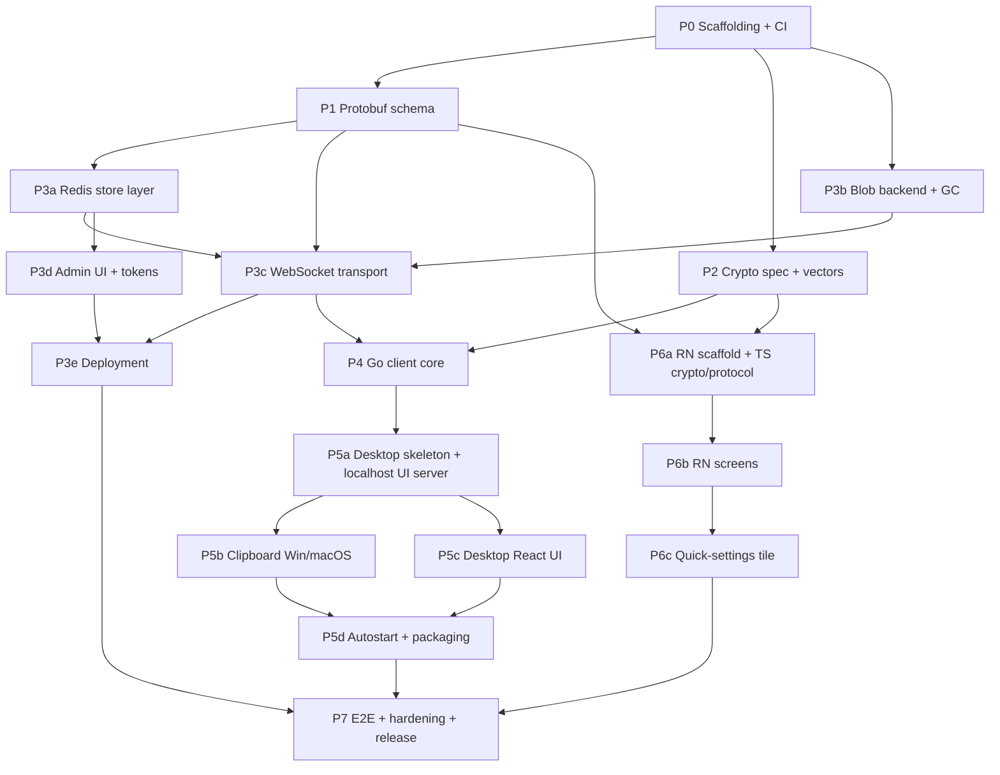

# TwoPlacePlace — Implementation Roadmap

**Companion to:** `SPEC.md` v0.1
**Purpose:** a phase-by-phase execution plan that coding agents can follow, one pull
request per phase, with explicit file ownership so that parallel agents never touch the
same paths.

---

## 0. How to use this document

- Every phase below is **exactly one pull request**.
- Each phase declares **Depends on**, **Owns (writable paths)**, **Must not touch**,
  **Deliverables**, and **Acceptance criteria**.
- An agent is only permitted to create or modify files under its phase's **Owns** list.
  If it believes it needs a file outside that list, it stops and reports instead of
  editing — that is the single rule that keeps parallel agents conflict-free.
- Phases marked ‖ with the same letter may run **simultaneously on separate agents**.

### Branch and PR conventions

```
branch:  phase/<id>-<slug>          e.g. phase/3a-redis-store
title:   [P<id>] <short description>
```

PR body template:

```markdown
## Phase
P<id> — <name>  (SPEC §<sections>)

## Depends on
#<pr numbers merged>

## Paths owned by this PR
- <path>

## Acceptance criteria
- [ ] <copied from the roadmap>

## Out of scope
<what a reviewer should NOT expect here>
```

Rules for agents:
1. Rebase on `main` before opening the PR. Never merge `main` into the branch.
2. No phase merges without its acceptance criteria checked and CI green.
3. If a phase needs a change to a shared contract (`proto/`, `crypto-spec`, `go.work`),
   it **does not make the change** — it opens an issue tagged `contract-change` and
   waits. Contract changes are always their own small PR, merged serially.

---

## 1. Repository layout

This layout is the basis of all conflict isolation. It is fixed in Phase 0 and is not
renegotiated later.

```
/proto/                      protobuf schema (shared contract — serialized changes only)
/spec/
  crypto.md                  algorithm decisions, wire formats
  vectors/                   cross-language crypto test vectors (JSON)
/server/                     Go module: relay + admin
  cmd/tpp/                   binary entrypoint, CLI (incl. gc --verify)
  internal/config/
  internal/store/            Redis persistent zone
  internal/entries/          Redis ephemeral zone
  internal/blob/             blob backend interface, disk impl, sweeper
  internal/ws/               WebSocket transport + frame handlers
  internal/admin/            admin UI handlers, sessions, rate limit
  internal/httpapi/          router assembly  ← SHARED TOUCHPOINT, see §4
  web/admin/                 admin UI assets
/pkg/tppclient/              Go module: shared client core (crypto, WS client, flows)
/desktop/                    Go module: tray service
  cmd/tppdesktop/
  internal/clipboard/        per-OS clipboard implementations
  internal/tray/
  internal/localui/          localhost HTTP server, token + Origin guard, embed
  internal/autostart/
  ui/                        React app for the localhost UI
/mobile/                     React Native app
  src/crypto/
  src/protocol/
  src/screens/
  android/                   native modules (quick-settings tile)
/deploy/                     docker-compose, .env.example, redis.conf
/docs/
/go.work                     ← SHARED TOUCHPOINT
```

---

## 2. Phase graph



### Parallel lanes

| Lane | Phases | Safe because |
|---|---|---|
| ‖A | **P1** and **P2** | `/proto/` vs `/spec/` — disjoint |
| ‖B | **P3a** and **P3b** | `internal/store` vs `internal/blob` — no shared file |
| ‖C | **P3c** and **P3d** | `internal/ws` vs `internal/admin` — ⚠ both register routes, see §4 |
| ‖D | **server track (P3\*)** and **mobile track (P6a)** | `/server/` vs `/mobile/` — different languages, different agents |
| ‖E | **desktop track (P5\*)** and **mobile track (P6\*)** | `/desktop/` vs `/mobile/` — fully disjoint, the widest parallel window |
| ‖F | **P5b** and **P5c** | `internal/clipboard` (Go, per-OS) vs `ui/` (TypeScript) |
| ‖G | **P3e** and **P4** | `/deploy/` vs `/pkg/tppclient/` |

**Recommended two-agent schedule**

```
week 1   agent A: P0 → P1        agent B: (idle) → P2
week 2   agent A: P3a → P3b      agent B: P6a
week 3   agent A: P3c            agent B: P3d          (see §4 caveat)
week 4   agent A: P4 → P3e       agent B: P6b
week 5   agent A: P5a → P5b      agent B: P6c
week 6   agent A: P5c → P5d      agent B: P7 prep
```

---

## 3. Contract changes (serialized, never parallel)

Three artifacts are shared by every downstream phase. Changes to them are always their
own PR and are **never** made inside a feature phase:

| Artifact | Owner phase | Change procedure |
|---|---|---|
| `/proto/**` | P1 | `contract-change` issue → dedicated PR → regenerate both Go and TS → downstream rebases |
| `/spec/crypto.md` + `/spec/vectors/**` | P2 | same |
| `/go.work`, root `Makefile`, CI workflow | P0 | same |

---

## 4. The one dangerous overlap

`P3c` (WebSocket) and `P3d` (admin UI) both need to attach handlers to the HTTP router.
If both agents edit the router file, you get a conflict on the one file that is hardest
to auto-merge.

**Mitigation, decided in P0:** `internal/httpapi/router.go` is written once in **P0** as
a registry:

```go
type Registrar interface{ Register(mux *http.ServeMux) }

func New(regs ...Registrar) http.Handler { /* ... */ }
```

P3c adds `internal/ws/register.go`; P3d adds `internal/admin/register.go`. Wiring happens
in `cmd/tpp/main.go`, which is owned by **P3e** and edited by neither. Both agents are
told: *do not edit `router.go` or `main.go`.*

---

## PHASE 0 — Scaffolding, tooling, CI

**Depends on:** nothing.
**Owns:** `/go.work`, `/Makefile`, `/.github/workflows/**`, `/.gitignore`, `/README.md`,
`/docs/conventions.md`, empty module skeletons (`server`, `pkg/tppclient`, `desktop`),
`/server/internal/httpapi/router.go`, `/server/internal/config/`.
**Must not touch:** anything else (nothing else exists yet).

**Deliverables**
- Go workspace with three modules; Go 1.23+.
- `Makefile` targets: `proto`, `build`, `test`, `lint`, `run-server`.
- CI: build + `go vet` + `golangci-lint` + `go test ./...` per module; Node lint/test job
  gated on changed paths so mobile changes don't run Go jobs and vice versa.
- Config loader (§4.4, §9): reads `.env`, accepts `ADMIN_PASSWORD` **or**
  `ADMIN_PASSWORD_HASH`, so hashing later is config-only.
- `router.go` registry per §4 above.
- `docs/conventions.md`: error wrapping, logging (structured, `log/slog`), context
  propagation, table-driven tests, no panics in request paths.

**Acceptance:** `make build test lint` passes on a clean checkout; CI green.

---

## PHASE 1 — Protobuf schema ‖A

**Depends on:** P0. **SPEC §5.1**
**Owns:** `/proto/**`, codegen config, generated output dirs
(`/pkg/tppclient/protogen/`, `/mobile/src/protocol/gen/`).
**Must not touch:** any handler or business logic.

**Deliverables**
- `tpp/v1/envelope.proto` — every frame is `Envelope{ id, type, payload }` so the
  transport can be swapped later at zero cost (spec's stated reason for keeping protobuf).
- Message set, minimum:
  - `CreateGroupRequest/Response` (token, device pubkey, wrapped group key, device name)
  - `PairingStartRequest/Response`, `PairingJoinRequest`, `PairingJoinNotice`,
    `PairingWrappedKeyUpload`, `PairingComplete`
  - `DeviceListRequest/Response`
  - `RekeyRequest` (**array** of `{device_id, wrapped_key}` — single request, atomic per §3.3),
    `RekeyResponse{ epoch }`
  - `EntryPutRequest` (epoch, size, ciphertext **or** upload handle), `EntryPutResponse`
  - `EntryLatestRequest/Response`, `EntryHistoryRequest/Response`, `EntryFetchRequest/Response`
  - `EpochChanged`, `WrappedKeyAvailable`, `DeviceRevoked` server-push events
  - `Error{ code, message }` with a stable enum
- Codegen for Go (`protoc-gen-go`) and TS (`ts-proto`), both wired into `make proto`.
- Generated code is **committed**, and CI fails if regeneration produces a diff.

**Acceptance:** `make proto` is idempotent; both language outputs compile.

---

## PHASE 2 — Crypto specification and cross-language vectors ‖A

**Depends on:** P0. **SPEC §2.2**
**Owns:** `/spec/crypto.md`, `/spec/vectors/**`.
**Must not touch:** any implementation.

This phase writes **no product code**. Its output is a document plus JSON vectors that Go
and TypeScript implementations must both reproduce. This is what stops the Go client and
the RN client from silently disagreeing.

**Decisions to pin down (recommended defaults)**
- Device keypair: **X25519**.
- Group key wrapping: **libsodium sealed box** (`crypto_box_seal`) to the device pubkey —
  anonymous, no sender key management, exactly the shape §3.2 step 4 needs.
- Entry encryption: **XChaCha20-Poly1305**, 24-byte random nonce per entry.
- Content key: `HKDF-SHA256(group_key, salt=nonce, info="tpp/v1/entry" || epoch)` — the
  group key is never used directly as a content key (§2.2 requirement).
- AAD binds `epoch || entry_id || content_type` so a re-typed or replayed entry fails.
- Entry plaintext framing: `{ content_type, filename?, created_at, body }` serialized
  before encryption, so **content type is hidden from the server** (§2.3).
- Padding: reserve a `pad_len` field, always zero in MVP (§9 keeps the door open).
- Library choice: Go `filippo.io/edwards25519` + `golang.org/x/crypto`; TS **@noble/ciphers
  + @noble/curves** — pure JS, no per-platform native module to maintain, matching the
  spec's stated aversion to native modules.

**Deliverables**
- `crypto.md` covering: key derivation, wire byte layouts, epoch handling, what a client
  does when it receives an entry from an older epoch (skip silently, §3.3).
- `vectors/` — at least 20 vectors: wrap/unwrap, entry encrypt/decrypt, HKDF derivation,
  AAD mismatch must fail, wrong-epoch must fail.

**Acceptance:** vectors are language-neutral JSON with hex fields; `crypto.md` is
unambiguous enough that two implementers cannot diverge.

---

## PHASE 3a — Redis persistent store ‖B ‖D

**Depends on:** P1. **SPEC §4.2, §3.1, §3.2, §3.3**
**Owns:** `/server/internal/store/**`.
**Must not touch:** `internal/ws`, `internal/admin`, `internal/blob`, `main.go`, `router.go`.

**Deliverables**
- Key layout from §4.2 implemented behind a `Store` interface.
- Operations: `CreateToken`, `ConsumeToken` (atomic — Lua), `CreateGroup`, `AddDevice`,
  `ListDevices`, `GetWrappedKey`, `RemoveDevice`, `ApplyRekey`, `CreatePairing`,
  `ConsumePairing`, `TouchLastSeen`.
- **`ApplyRekey` is a single Lua script**: writes all wrapped keys, deletes the revoked
  device, increments epoch — all-or-nothing (§3.3 step 4). A partial apply is a bug, and
  there must be a test that kills the operation mid-way and asserts the old epoch survives.
- Token consumption is likewise a Lua CAS: one token → exactly one group, no races.
- `volatile-lru` assumption documented in code near every persistent-zone write.

**Acceptance:** integration tests against a real Redis (testcontainers or a CI service
container); concurrency test firing 50 simultaneous `ConsumeToken` calls and asserting
exactly one succeeds.

---

## PHASE 3b — Blob backend and expiry-bucket GC ‖B

**Depends on:** P0. **SPEC §4.3, §4.5**
**Owns:** `/server/internal/blob/**`, `/server/cmd/tpp/gc.go`.
**Must not touch:** `internal/store`, `internal/ws`, `internal/admin`, `main.go`.

This phase is deliberately independent of Redis. It only needs the interface.

**Deliverables**
- `Backend` interface: `Put(entryID string, expiresAt time.Time, r io.Reader) (ref string, err error)`,
  `Get(ref)`, `Delete(ref)`, `Sweep(now time.Time) error`.
- Disk implementation writing `blobs/<YYYYMMDDHH>/<entry_id>.bin`, bucket = UTC
  `created_at + 24h` **rounded up** to the hour. All time handling UTC; a test must assert
  correct behaviour across a DST boundary in a non-UTC local zone.
- Sweeper: lists only immediate child dirs, parses bucket, `RemoveAll` on fully-passed
  buckets. **No Redis queries, no per-file stat.** Test asserts O(buckets) not O(blobs)
  by writing 10 000 blobs and counting syscalls or timing.
- Scheduler: run once at startup, then every 10 min on a goroutine, cancellable by context.
- 10 MB ciphertext cap enforced at the reader (`io.LimitReader` + explicit error), not
  after buffering.
- Stub `s3` backend whose `Sweep()` is a documented no-op.
- `tpp gc --verify`: mark-and-sweep cross-check, **report only, never delete**, clearly
  documented as a manual post-incident tool.

**Acceptance:** unit tests for bucket maths at hour boundaries; sweep test with buckets in
past/current/future; oversize upload rejected without full buffering.

---

## PHASE 3c — WebSocket transport and protocol handlers ‖C

**Depends on:** P1, P3a, P3b. **SPEC §5, §3, §6**
**Owns:** `/server/internal/ws/**` (including `register.go`), `/server/internal/entries/**`.
**Must not touch:** `internal/admin`, `router.go`, `main.go`, `internal/store` (consume its
interface only — if the store lacks a method, that's a `contract-change` issue).

**Deliverables**
- WebSocket upgrade, binary frames, protobuf envelope decode/dispatch.
- Per-connection auth: device identity established at connect; unauthenticated
  connections may only run group creation and pairing-join.
- Handlers for every message in P1.
- Hub: per-group fan-out of `EpochChanged`, `WrappedKeyAvailable`, `DeviceRevoked`, and
  the pairing notification to the inviter (§3.2 step 3).
- Entry write path: **blob first, Redis entry second** (§4.5 write ordering). Inline if
  ≤256 KB, else via blob backend, with the entry holding only the ref.
- Latest-entry semantics and history listing (§6). Server never pushes history.
- Session termination on revocation: the revoked device's socket is closed and its
  credentials invalidated in the same operation (§3.3 step 5).
- Backpressure: bounded write queue per connection, slow client dropped rather than
  buffered without limit.

**Acceptance:** protocol-level tests driving a real WS connection through: create group →
pair second device → put entry → second device fetches latest → rekey → first device sees
`EpochChanged` → revoked device's socket is closed.

---

## PHASE 3d — Admin UI, creation tokens, login hardening ‖C

**Depends on:** P3a. **SPEC §4.4**
**Owns:** `/server/internal/admin/**` (including `register.go`), `/server/web/admin/**`.
**Must not touch:** `internal/ws`, `router.go`, `main.go`.

**Deliverables**
- Login with credentials from config; session cookie `HttpOnly`, `SameSite=Strict`,
  `Secure`, short expiry.
- Rate limiting on `/admin/login` — this endpoint is publicly reachable. Per-IP token
  bucket plus a global cap; log lockouts.
- Single screen: token list (name, created, used, resulting group id) + "generate token".
  Nothing else. No content access by construction, no statistics.
- Each token rendered as a **QR code** of `https://<host>/<token>` (§4.4).
- `GET /<token>` returns **404** (§3.1) — implemented and tested here, so crawlers and
  link previews can never burn a token.
- Server-rendered Go templates are fine; avoid pulling a second React build into the
  server module.

**Acceptance:** login rate limit test; `GET /<token>` returns 404 while the token remains
usable by `POST`; cookie flags asserted in tests.

---

## PHASE 3e — Deployment and wiring ‖G

**Depends on:** P3c, P3d.
**Owns:** `/deploy/**`, `/server/cmd/tpp/main.go`, `/docs/deployment.md`.
**Must not touch:** any `internal/` package.

**Deliverables**
- `main.go` wiring the registrars, store, blob backend, sweeper, graceful shutdown.
- `docker-compose.yml`: Go server + Redis. Redis configured with **AOF persistence** and
  **`maxmemory-policy volatile-lru`** — with an inline comment explaining that
  `allkeys-lru` would silently evict group records and destroy pairings (§4.2).
- `.env.example` with every key documented.
- Healthcheck endpoint; container runs as non-root; blob volume mounted.
- `docs/deployment.md`: reverse proxy + TLS termination expectations (§4.1).

**Acceptance:** `docker compose up` from a clean machine yields a working server; killing
and restarting the stack preserves groups and devices and drops expired entries.

---

## PHASE 4 — Go client core (`pkg/tppclient`) ‖G

**Depends on:** P1, P2, P3c.
**Owns:** `/pkg/tppclient/**`.
**Must not touch:** `/server/**`, `/desktop/**`.

The desktop app should contain **no crypto and no protocol logic** — it is a shell around
this package. That is what keeps a future Linux or CLI client cheap.

**Deliverables**
- Keypair generation and OS-appropriate private key storage (keychain / DPAPI, with an
  encrypted-file fallback).
- Group key wrap/unwrap; entry encrypt/decrypt — **validated against `/spec/vectors`**.
- WS client with reconnect, backoff, and event callbacks.
- Flows as one method each: `CreateGroup(url)`, `StartPairing() (payload, error)`,
  `JoinPairing(payload)`, `Revoke(deviceID)` (returns the roster so the caller can render
  the §3.3 confirmation — the library never assumes consent), `PutEntry`, `GetLatest`,
  `GetHistory`.
- Epoch handling: entries below the current epoch are skipped silently; a newly received
  wrapped key advances the epoch. **Never touch the OS clipboard from this package** —
  the §3.3 "local clipboard is never touched by a rekey" invariant is structurally
  guaranteed by the package having no clipboard access at all.

**Acceptance:** vector tests pass; an integration test runs two in-process clients against
a real server through the full pair → sync → rekey cycle.

---

## PHASE 5a — Desktop service skeleton and localhost UI server ‖E

**Depends on:** P4. **SPEC §7.2**
**Owns:** `/desktop/cmd/**`, `/desktop/internal/localui/**`, `/desktop/internal/tray/**`,
`/desktop/internal/config/**`.
**Must not touch:** `/desktop/internal/clipboard/**`, `/desktop/ui/**`, `/mobile/**`.

**Deliverables**
- Tray icon and menu: sync now, open UI, quit.
- HTTP server bound explicitly to **`127.0.0.1:47821`** — never `0.0.0.0` (§7.2).
- Per-launch token required on **every** request; tray opens
  `http://127.0.0.1:47821/app?token=<token>`.
- **`Origin` header validated on every request**, including WebSocket upgrade. Add a test
  that a request with a foreign `Origin` is rejected — this is the whole defence against
  a malicious page hitting localhost.
- Bind failure: tray shows an error, config file allows a port override. **Must not fail
  silently** (§7.2).
- `go:embed` of the built UI, with a dev mode proxying to Vite.
- Clipboard access behind an interface with a no-op stub, so 5b can land independently.

**Acceptance:** service starts, tray opens the browser, UI shell loads; foreign-Origin and
missing-token requests are rejected; occupied port surfaces a visible error.

---

## PHASE 5b — Clipboard implementations (Windows, macOS) ‖E ‖F

**Depends on:** P5a.
**Owns:** `/desktop/internal/clipboard/**` only.
**Must not touch:** everything else.

**Deliverables**
- `clipboard_windows.go`, `clipboard_darwin.go` behind the P5a interface: read/write text,
  image, and file references.
- Optional auto-watch with a **default-off** toggle (§7.2), polling with change detection,
  self-write suppression so a paste from the service doesn't re-upload itself.
- Direction logic per §6: upload if local is newer, otherwise download; where the platform
  timestamp is unreliable, expose the two explicit directional buttons instead of guessing.

**Acceptance:** manual test matrix on both OSes for text and image; loop test proving a
service-originated write does not trigger an upload.

---

## PHASE 5c — Desktop React UI ‖E ‖F

**Depends on:** P5a (for the local API contract only).
**Owns:** `/desktop/ui/**`.
**Must not touch:** any Go file.

**Deliverables**
- Screens: sync (with status/last-synced), history browser with copy-to-clipboard per
  entry, device management with the **named-device confirmation dialog required by §3.3
  step 2**, pairing (show QR + copyable token; no scanner on desktop).
- Settings: auto-watch toggle (off), autostart toggle (off), port override.
- Token from the query string is captured once and kept in memory — never in
  `localStorage`, never left in the URL bar.

**Acceptance:** builds to static assets consumable by `go:embed`; the revoke dialog cannot
be confirmed without the roster having loaded.

---

## PHASE 5d — Autostart and packaging ‖E

**Depends on:** P5b, P5c.
**Owns:** `/desktop/internal/autostart/**`, `/desktop/packaging/**`, desktop CI workflow job.
**Must not touch:** `/mobile/**`, `/server/**`.

**Deliverables**
- macOS launchd plist, Windows registry Run key; **default off**, toggleable (§7.2).
- Signed-where-possible installers: `.dmg` / `.app`, and MSI or NSIS on Windows.
- UI build → embed → binary build in one CI job.

---

## PHASE 6a — RN scaffold, TS crypto, protocol client ‖D ‖E

**Depends on:** P1, P2. **Not** on the server phases — it can start in week 2.
**Owns:** `/mobile/**` except `src/screens/` and `android/app/src/main/java/**/tile/`.
**Must not touch:** `/server/**`, `/desktop/**`, `/pkg/**`.

**Deliverables**
- RN project structured so iOS remains addable without restructuring (§7.3): all platform
  access behind `src/platform/` with per-OS files.
- TS crypto with `@noble/*`, **validated against `/spec/vectors`** — the same JSON the Go
  client uses.
- Keypair storage in Android Keystore-backed encrypted storage.
- WS protocol client mirroring P4's flow methods, connected only while foregrounded (§5.2).

**Acceptance:** vector tests green in Jest; a scripted test pairs the RN client with a Go
client against a local server.

---

## PHASE 6b — Android screens ‖E

**Depends on:** P6a. **SPEC §7.1, §6**
**Owns:** `/mobile/src/screens/**`, `/mobile/src/navigation/**`.
**Must not touch:** `src/crypto/`, `src/protocol/`, native tile code.

**Deliverables**
- Manual sync button with clear direction feedback.
- History tab with an **explicit fetch button** — nothing is pulled on reconnect (§6).
  Tap an entry to copy it locally.
- Device management with the §3.3 named confirmation before revoke.
- Pairing: show QR, scan QR (camera), paste token — all three, since the payload is
  identical in every direction (§3.2).
- New devices start empty and do not attempt to fetch pre-join entries (§3.2).

---

## PHASE 6c — Quick-settings tile ‖E

**Depends on:** P6b. **SPEC §7.1**
**Owns:** `/mobile/android/app/src/main/java/**/tile/**`, tile manifest entries.
**Must not touch:** JS/TS sources.

**Deliverables**
- `TileService` that briefly foregrounds the app — the only legal moment to read the
  clipboard on Android 10+ — performs one sync, and reports success/failure via the tile
  state and a toast.
- No accessibility service. No background clipboard polling. If auto-sync proves
  infeasible, it is **dropped, not worked around** (§7.1).

**Acceptance:** tile sync works from a locked-then-unlocked device and from another app;
documented behaviour on Android 12/13/14.

---

## PHASE 7 — End-to-end verification, hardening, release

**Depends on:** P3e, P5d, P6c.
**Owns:** `/e2e/**`, `/docs/**`, release workflow, `SECURITY.md`.

**Deliverables**
- E2E suite covering the MVP definition of done: create group, pair additional devices,
  manual sync, end-to-end encryption verified by asserting the server's stored bytes are
  not the plaintext.
- Revocation drill: 3 devices, revoke one while another is offline; the offline device
  picks up its wrapped key on next connect and the revoked one cannot decrypt.
- Failure drills: Redis restart (AOF recovery), server downtime longer than a bucket
  (startup sweep clears accumulated garbage), 10 MB boundary, 256 KB inline boundary.
- Threat-model review against §2.3: confirm the server log contains no plaintext, no
  content type, and no filenames.
- `docs/` — install, pairing walkthrough, revocation, backup/restore.
- Tagged release with artefacts for Windows, macOS, Android.

---

## 5. Deferred backlog (do not let agents start these)

| Item | Spec ref |
|---|---|
| Push delivery for Android (FCM gateway / UnifiedPush / WS-only) | §9 |
| Plaintext padding | §9 |
| Admin password hashing (config loader already accommodates) | §4.4, §9 |
| S3 blob backend implementation | §4.3 |
| iOS client + share-sheet extension | §7.3 |
| Linux desktop (tray, X11/Wayland clipboard, packaging) | §7.4 |
| Auto-sync on Android | §7.1 |

**Standing prohibition:** no pin, favourite, or extend-TTL feature. Entry lifetimes are
immutable, and the entire §4.5 GC scheme depends on that. Any agent proposing one must be
redirected to §4.5's invariant.
