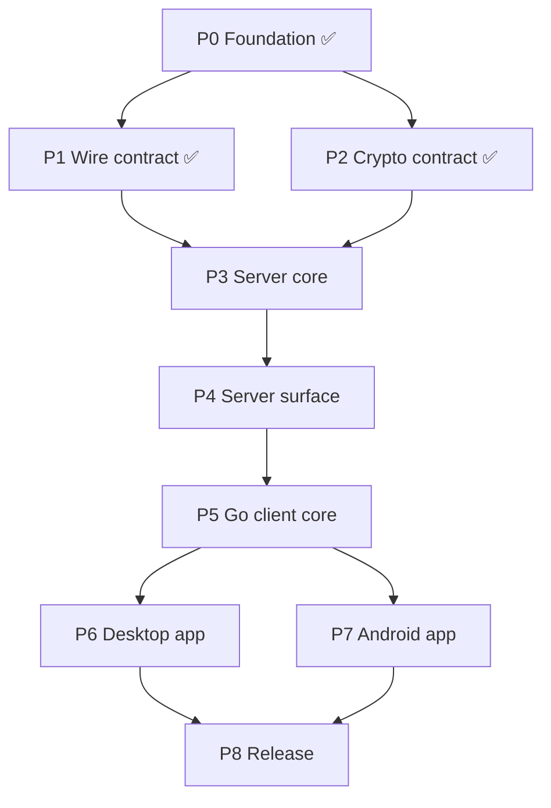

# TwoPlacePaste — Implementation Roadmap

**Companion to:** `docs/SPECS.md` v0.1
**Purpose:** the execution plan for coding agents. One phase = one branch = one pull
request. Phases run in numeric order; only one pair of phases may overlap.

---

## Status board

| Phase | Name | Status | Depends on |
|---|---|---|---|
| **P0** | Foundation — scaffolding, config, CI | ✅ **Done** (#1) | — |
| **P1** | Wire contract — protobuf schema + codegen | ✅ **Done** (#2) | P0 |
| **P2** | Crypto contract — spec + cross-language vectors | ✅ **Done** (#3) | P0 |
| **P3** | Server core — storage, blobs, WebSocket protocol | ▶ **Next** | P1, P2 |
| **P4** | Server surface — admin UI, tokens, deployment | ⏳ Blocked | P3 |
| **P5** | Go client core — `pkg/tppclient` | ⏳ Blocked | P4 |
| **P6** | Desktop app — Windows + macOS | ⏳ Blocked | P5 |
| **P7** | Android app | ⏳ Blocked | P5 (server from P4 for tests) |
| **P8** | Release — E2E, hardening, docs, artefacts | ⏳ Blocked | P6, P7 |

**Only P6 and P7 may run at the same time** (different languages, disjoint directories,
no shared file). Everything else is strictly sequential. Running a single agent through
P3 → P4 → P5 → P6 → P7 → P8 is a fully valid schedule; nothing in this roadmap requires
parallelism.

When a phase merges, update its row here to ✅ and flip the next row to ▶.

---

## How to run a phase

Give the agent exactly this:

> Implement **Phase N** from `docs/ROADMAP.md`. Follow `docs/conventions.md`. Work only
> inside the phase's **Owns** paths. Open one PR when every acceptance criterion passes.

Everything the agent needs is in that phase's section below. It should not need to read
other phases.

### Rules for every phase

1. Branch from and rebase on `master`. Never merge `master` into the branch.
2. Create or modify files **only** under the phase's **Owns** list. If the phase seems to
   need a file outside it, stop and report instead of editing — that rule is what keeps
   phases reviewable and conflict-free.
3. Shared contracts — `/proto/**`, `/spec/**`, `/go.work`, root `Makefile`, CI workflows —
   are **never** changed inside a feature phase. A needed change becomes its own small PR,
   merged on its own, and the phase rebases on it.
4. No phase merges without all acceptance criteria met and CI green.

### PR conventions

```
title:  [P<id>] <short description>
```

```markdown
## Phase
P<id> — <name>  (SPEC §<sections>)

## Paths owned by this PR
- <path>

## Acceptance criteria
- [ ] <copied from the roadmap>

## Out of scope
<what a reviewer should NOT expect here>
```

---

## Repository layout

Fixed in P0, not renegotiated later. Phase ownership is expressed in terms of it.

```
/proto/                      protobuf schema (shared contract)
/spec/
  crypto.md                  algorithm decisions, wire formats
  vectors/                   cross-language crypto test vectors (JSON)
/server/                     Go module: relay + admin
  cmd/tpp/                   binary entrypoint, CLI (incl. gc --verify)
  internal/config/
  internal/store/            Redis persistent zone
  internal/entries/          Redis ephemeral zone
  internal/blob/             blob backend interface, disk impl, sweeper
  internal/ws/               WebSocket transport + frame handlers
  internal/admin/            admin UI handlers, sessions, rate limit
  internal/httpapi/          router assembly (registry, written in P0)
  web/admin/                 admin UI assets
/pkg/tppclient/              Go module: shared client core (crypto, WS client, flows)
/desktop/                    Go module: tray service
  cmd/tppdesktop/
  internal/clipboard/        per-OS clipboard implementations
  internal/localui/          localhost HTTP server, token + Origin guard, embed
  internal/tray/
  internal/autostart/
  ui/                        React app for the localhost UI
/mobile/                     React Native app
  src/crypto/  src/protocol/  src/screens/  src/platform/
  android/                   native modules (quick-settings tile)
/deploy/                     docker-compose, .env.example, redis.conf
/docs/
/go.work
```

### Router wiring

`internal/httpapi/router.go` (P0) is a registry:

```go
type Registrar interface{ Register(mux *http.ServeMux) }

func New(regs ...Registrar) http.Handler { /* ... */ }
```

P3 adds `internal/ws/register.go`; P4 adds `internal/admin/register.go` and does the
wiring in `cmd/tpp/main.go`. **P3 does not touch `router.go` or `main.go`.**

---

## Phase graph



---

# PHASE 0 — Foundation ✅ Done

**SPEC §4.4, §9** · **Owns:** `/go.work`, `/Makefile`, `/.github/workflows/**`,
`/.gitignore`, `/README.md`, `/docs/conventions.md`, module skeletons,
`/server/internal/httpapi/router.go`, `/server/internal/config/**`.

Delivered: Go workspace with three modules; `make proto build test lint run-server`; CI
running build, `go vet`, `golangci-lint` and tests per module with path-gated Node jobs;
config loader accepting `ADMIN_PASSWORD` **or** `ADMIN_PASSWORD_HASH` so hashing later is
config-only; the router registry above; `docs/conventions.md` (error wrapping, `log/slog`,
context propagation, table-driven tests, no panics in request paths).

---

# PHASE 1 — Wire contract ✅ Done

**SPEC §5.1** · **Owns:** `/proto/**`, codegen config, `/pkg/tppclient/protogen/`,
`/mobile/src/protocol/gen/`.

Delivered: `tpp/v1/envelope.proto` — every frame is `Envelope{ id, type, payload }`, so
the transport can be swapped later at no cost — plus group, pairing, entry, event and
error messages; `RekeyRequest` carries an **array** of `{device_id, wrapped_key}` for the
atomic rekey of §3.3. Codegen for Go (`protoc-gen-go`) and TS (`ts-proto`) wired into
`make proto`; generated code committed; CI fails if regeneration produces a diff.

---

# PHASE 2 — Crypto contract ✅ Done

**SPEC §2.2** · **Owns:** `/spec/crypto.md`, `/spec/vectors/**`.

Delivered: X25519 device keys; group key wrapped with a libsodium sealed box
(`crypto_box_seal`); entries sealed with XChaCha20-Poly1305 under a per-entry content key
`HKDF-SHA256(group_key, salt=nonce, info="tpp/v1/entry" || epoch)`; AAD binding
`epoch || entry_id || content_type`; plaintext framing that hides content type from the
server; a reserved `pad_len`, zero in MVP. Library choice: Go `golang.org/x/crypto`, TS
`@noble/*` (no native modules). `/spec/vectors/**` holds the language-neutral JSON both
implementations must reproduce, including must-fail cases (AAD mismatch, wrong epoch).

**Every later phase that touches crypto validates against these vectors — it does not
re-derive the algorithms.**

---

# PHASE 3 — Server core ▶ Next

**Depends on:** P1, P2. **SPEC §3, §4.2, §4.3, §4.5, §5, §6**
**Owns:** `/server/internal/store/**`, `/server/internal/blob/**`,
`/server/internal/entries/**`, `/server/internal/ws/**` (including `register.go`),
`/server/cmd/tpp/gc.go`.
**Must not touch:** `internal/admin`, `internal/httpapi/router.go`, `cmd/tpp/main.go`,
`/proto/**`, `/spec/**`.

This is the whole relay minus its operator-facing surface. The three former sub-phases
(store, blobs, transport) are one phase because the transport is untestable without the
other two, and splitting them only bought parallelism that a single agent cannot use.

Build it in this order; each step is independently testable.

### 3.1 Redis persistent store — `internal/store`

- Key layout from §4.2 behind a `Store` interface.
- Operations: `CreateToken`, `ConsumeToken`, `CreateGroup`, `AddDevice`, `ListDevices`,
  `GetWrappedKey`, `RemoveDevice`, `ApplyRekey`, `CreatePairing`, `ConsumePairing`,
  `TouchLastSeen`.
- **`ApplyRekey` is a single Lua script**: writes every wrapped key, deletes the revoked
  device and increments the epoch, all-or-nothing (§3.3 step 4). A partial apply is a bug;
  there must be a test that kills the operation mid-way and asserts the old epoch survives.
- `ConsumeToken` is likewise a Lua CAS: one token → exactly one group, no races.
- Document the `volatile-lru` assumption in code next to every persistent-zone write.

### 3.2 Blob backend and expiry-bucket GC — `internal/blob`, `cmd/tpp/gc.go`

- `Backend` interface: `Put(entryID string, expiresAt time.Time, r io.Reader) (ref string, err error)`,
  `Get(ref)`, `Delete(ref)`, `Sweep(now time.Time) error`.
- Disk implementation writing `blobs/<YYYYMMDDHH>/<entry_id>.bin`, bucket = UTC
  `created_at + 24h` **rounded up** to the hour. All time handling UTC; a test must assert
  correct behaviour across a DST boundary in a non-UTC local zone.
- Sweeper: list only immediate child dirs, parse the bucket, `RemoveAll` fully-passed
  buckets. **No Redis queries, no per-file stat.** A test writes 10 000 blobs and proves
  the sweep is O(buckets), not O(blobs).
- Scheduler: once at startup, then every 10 min on a goroutine, cancellable by context.
- 10 MB ciphertext cap enforced at the reader (`io.LimitReader` + explicit error), never
  after buffering.
- Stub `s3` backend whose `Sweep()` is a documented no-op.
- `tpp gc --verify`: mark-and-sweep cross-check, **report only, never delete**, documented
  as a manual post-incident tool.

### 3.3 WebSocket transport and handlers — `internal/ws`, `internal/entries`

- WebSocket upgrade, binary frames, protobuf envelope decode and dispatch.
- Per-connection auth: device identity established at connect. Unauthenticated
  connections may only run group creation and pairing-join.
- A handler for every message defined in P1.
- Hub: per-group fan-out of `EpochChanged`, `WrappedKeyAvailable`, `DeviceRevoked`, and
  the pairing notification to the inviter (§3.2 step 3).
- Entry write path: **blob first, Redis entry second** (§4.5 ordering). Inline if ≤256 KB,
  otherwise through the blob backend with the entry holding only the ref.
- Latest-entry semantics and history listing (§6). The server never pushes history.
- Revocation closes the revoked device's socket and invalidates its credentials in the
  same operation (§3.3 step 5).
- Backpressure: bounded per-connection write queue; a slow client is dropped, never
  buffered without limit.
- `register.go` exposing the `httpapi.Registrar` — **do not edit `router.go`**.

### Acceptance

- [ ] Store integration tests against a real Redis (CI service container), including 50
      simultaneous `ConsumeToken` calls where exactly one succeeds.
- [ ] Rekey interruption test: old epoch survives a partial apply.
- [ ] Bucket maths tested at hour and DST boundaries; sweep tested with past, current and
      future buckets; oversize upload rejected without full buffering.
- [ ] Protocol test driving a real WS connection through: create group → pair a second
      device → put entry → second device fetches latest → rekey → first device sees
      `EpochChanged` → revoked device's socket is closed.
- [ ] `make build test lint` green.

---

# PHASE 4 — Server surface: admin, tokens, deployment

**Depends on:** P3. **SPEC §3.1, §4.1, §4.4**
**Owns:** `/server/internal/admin/**` (including `register.go`), `/server/web/admin/**`,
`/server/cmd/tpp/main.go`, `/deploy/**`, `/docs/deployment.md`.
**Must not touch:** `internal/store`, `internal/blob`, `internal/ws`, `internal/entries`,
`router.go`.

Admin and deployment are one phase because `main.go` is where both registrars meet: the
admin surface is not reachable until something wires it, and wiring is the deployment
step. This phase is the first one that produces a runnable server.

**Deliverables**
- Login with credentials from the P0 config loader. Session cookie `HttpOnly`,
  `SameSite=Strict`, `Secure`, short expiry.
- Rate limiting on `/admin/login` — it is publicly reachable. Per-IP token bucket plus a
  global cap; log lockouts.
- One screen: token list (name, created, used, resulting group id) and "generate token".
  Nothing else — no content access by construction, no statistics.
- Each token rendered as a **QR code** of `https://<host>/<token>` (§4.4).
- `GET /<token>` returns **404** (§3.1), so crawlers and link previews can never burn a
  token; `POST` still consumes it.
- Server-rendered Go templates. Do not pull a second React build into the server module.
- `main.go`: wire the registrars, store, blob backend and sweeper; graceful shutdown;
  healthcheck endpoint.
- `deploy/docker-compose.yml`: Go server + Redis, with Redis on **AOF persistence** and
  **`maxmemory-policy volatile-lru`** — inline comment explaining that `allkeys-lru` would
  silently evict group records and destroy pairings (§4.2). Container runs non-root; blob
  volume mounted.
- `deploy/.env.example` documenting every key.
- `docs/deployment.md`: reverse proxy and TLS termination expectations (§4.1).

### Acceptance

- [ ] Login rate-limit test; cookie flags asserted in tests.
- [ ] `GET /<token>` returns 404 while the token stays usable by `POST`.
- [ ] `docker compose up` on a clean machine yields a working server.
- [ ] Restarting the stack preserves groups and devices and drops expired entries.

---

# PHASE 5 — Go client core (`pkg/tppclient`)

**Depends on:** P4. **SPEC §2.2, §3, §5, §6**
**Owns:** `/pkg/tppclient/**`.
**Must not touch:** `/server/**`, `/desktop/**`, `/mobile/**`.

Desktop and any future CLI or Linux client are shells around this package: it holds
**all** crypto and protocol logic, and they hold none.

**Deliverables**
- Keypair generation and OS-appropriate private key storage (keychain / DPAPI, with an
  encrypted-file fallback).
- Group key wrap/unwrap and entry encrypt/decrypt, **validated against `/spec/vectors`**.
- WS client with reconnect, backoff and event callbacks.
- One method per flow: `CreateGroup(url)`, `StartPairing() (payload, error)`,
  `JoinPairing(payload)`, `Revoke(deviceID)` — returns the roster so the caller can render
  the §3.3 confirmation; the library never assumes consent — `PutEntry`, `GetLatest`,
  `GetHistory`.
- Epoch handling: entries below the current epoch are skipped silently; a newly received
  wrapped key advances the epoch.
- **No OS clipboard access anywhere in this package.** That is what structurally
  guarantees the §3.3 invariant that a rekey never touches the local clipboard.

### Acceptance

- [ ] Vector tests pass against `/spec/vectors`.
- [ ] Integration test runs two in-process clients against a real server through the full
      pair → sync → rekey → revoke cycle.

---

# PHASE 6 — Desktop app (Windows, macOS) ‖

**Depends on:** P5. **SPEC §6, §7.2** · May run in parallel with P7.
**Owns:** `/desktop/**`, desktop CI workflow job.
**Must not touch:** `/mobile/**`, `/server/**`, `/pkg/**`.

One phase, because the localhost server, the UI it serves, the clipboard it drives and
the installer that ships them are one product and one review. Build in this order:

### 6.1 Service skeleton and localhost UI server
- Tray icon and menu: sync now, open UI, quit.
- HTTP server bound explicitly to **`127.0.0.1:47821`** — never `0.0.0.0` (§7.2).
- A per-launch token required on **every** request; the tray opens
  `http://127.0.0.1:47821/app?token=<token>`.
- **`Origin` validated on every request**, WebSocket upgrade included, with a test that a
  foreign `Origin` is rejected. This is the entire defence against a malicious page
  reaching localhost.
- Bind failure surfaces a visible tray error and a config port override — **never fails
  silently** (§7.2).
- `go:embed` of the built UI, plus a dev mode proxying to Vite.

### 6.2 Clipboard — `internal/clipboard`
- `clipboard_windows.go` and `clipboard_darwin.go` behind one interface: read and write
  text, image and file references.
- Optional auto-watch, **default off** (§7.2): polling with change detection and
  self-write suppression, so a paste from the service never re-uploads itself.
- Direction logic per §6: upload if local is newer, otherwise download. Where the platform
  timestamp is unreliable, expose the two explicit directional buttons rather than guess.

### 6.3 React UI — `desktop/ui`
- Screens: sync (status, last-synced); history browser with copy-to-clipboard per entry;
  device management with the **named-device confirmation dialog required by §3.3 step 2**;
  pairing (show QR + copyable token — no scanner on desktop).
- Settings: auto-watch (off), autostart (off), port override.
- The query-string token is captured once and kept in memory — never `localStorage`, never
  left in the URL bar.

### 6.4 Autostart and packaging
- macOS launchd plist and Windows registry Run key, **default off**, toggleable (§7.2).
- Installers, signed where possible: `.dmg`/`.app`, MSI or NSIS.
- One CI job: UI build → embed → binary build.

### Acceptance

- [ ] Service starts, tray opens the browser, UI shell loads.
- [ ] Foreign-`Origin` and missing-token requests are rejected; an occupied port surfaces
      a visible error.
- [ ] Loop test proving a service-originated clipboard write does not trigger an upload.
- [ ] Manual matrix on both OSes for text and image.
- [ ] The revoke dialog cannot be confirmed before the roster has loaded.
- [ ] CI produces installable artefacts for both platforms.

---

# PHASE 7 — Android app ‖

**Depends on:** P5 for the flow shape; needs a P4 server to test against.
**SPEC §3.2, §5.2, §6, §7.1, §7.3** · May run in parallel with P6.
**Owns:** `/mobile/**` (except the committed `src/protocol/gen/` from P1), mobile CI job.
**Must not touch:** `/server/**`, `/desktop/**`, `/pkg/**`, `/proto/**`, `/spec/**`.

### 7.1 Scaffold, TS crypto, protocol client
- RN project structured so iOS stays addable without restructuring (§7.3): every platform
  access behind `src/platform/` with per-OS files.
- TS crypto with `@noble/*`, **validated against `/spec/vectors`** — the same JSON the Go
  client uses. This is what stops the two implementations from silently diverging.
- Keypair storage in Android Keystore-backed encrypted storage.
- WS protocol client mirroring P5's flow methods, connected only while foregrounded (§5.2).

### 7.2 Screens
- Manual sync button with clear direction feedback.
- History tab with an **explicit fetch button** — nothing is pulled on reconnect (§6). Tap
  an entry to copy it locally.
- Device management with the §3.3 named confirmation before revoke.
- Pairing: show QR, scan QR (camera) and paste token — all three; the payload is identical
  in every direction (§3.2).
- A new device starts empty and never attempts to fetch pre-join entries (§3.2).

### 7.3 Quick-settings tile
- A `TileService` that briefly foregrounds the app — the only legal moment to read the
  clipboard on Android 10+ — performs one sync, and reports success or failure through the
  tile state and a toast.
- No accessibility service. No background clipboard polling. If auto-sync proves
  infeasible it is **dropped, not worked around** (§7.1).

### Acceptance

- [ ] Vector tests green in Jest.
- [ ] A scripted test pairs the RN client with a Go client against a local server.
- [ ] Tile sync works from a locked-then-unlocked device and from another app; behaviour
      documented on Android 12/13/14.

---

# PHASE 8 — Release: E2E, hardening, docs

**Depends on:** P6, P7.
**Owns:** `/e2e/**`, `/docs/**`, release workflow, `SECURITY.md`.

**Deliverables**
- E2E suite covering the MVP definition of done: create group, pair additional devices,
  manual sync, and end-to-end encryption verified by asserting the server's stored bytes
  are not the plaintext.
- Revocation drill: three devices, revoke one while another is offline; the offline device
  picks up its wrapped key on next connect and the revoked one cannot decrypt.
- Failure drills: Redis restart (AOF recovery), server downtime longer than a bucket
  (startup sweep clears the accumulated garbage), the 10 MB and 256 KB boundaries.
- Threat-model review against §2.3: the server log contains no plaintext, no content type
  and no filenames.
- Docs: install, pairing walkthrough, revocation, backup and restore.
- Tagged release with artefacts for Windows, macOS and Android.

---

## Deferred backlog — do not let agents start these

| Item | Spec ref |
|---|---|
| Push delivery for Android (FCM gateway / UnifiedPush / WS-only) | §9 |
| Plaintext padding | §9 |
| Admin password hashing (the P0 config loader already accommodates it) | §4.4, §9 |
| S3 blob backend implementation | §4.3 |
| iOS client + share-sheet extension | §7.3 |
| Linux desktop (tray, X11/Wayland clipboard, packaging) | §7.4 |
| Auto-sync on Android | §7.1 |

**Standing prohibition:** no pin, favourite or extend-TTL feature. Entry lifetimes are
immutable and the entire §4.5 GC scheme depends on that. Any agent proposing one is
redirected to the §4.5 invariant.
